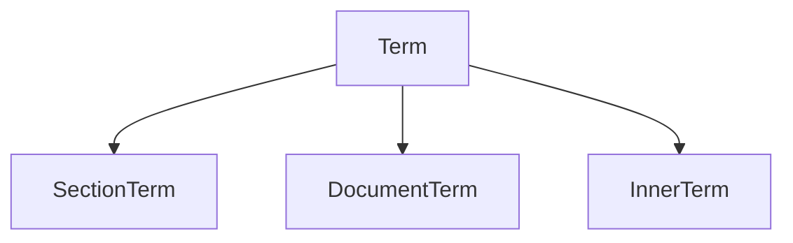
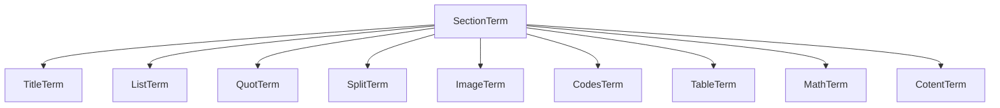
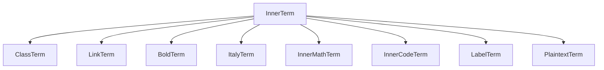

<style>
    #mid{
        float:left;
        text-align:center;
        width:100%;
    },
    .mermaid{
         float:left;
        text-align:center;
        width:100%;
    }
</style>
# 紧急修改
对于`lmd`文件，使用`document`类的`content`存储其文本内容，在`parse`方法中，一个个将标签分发到`vector<term>`中，之后递归的调用各个标签的`setcontent`方法存储内容，并使用`parse`方法转化为html。


> 设计文档

# 概要设计

* 总体思路：参照DOM树，构建一套强大，灵活的转化。

对于一个lmd文档，使用一个`document`节点容纳起来，其中下为`section`节点，`section`中包含着`content`节点。`content`节点包括着所有的实际内容，继承自`InnerTerm`
所有的`section`节点继承自`SectionTerm`这一虚类。

<span id="mid">图1 节点继承关系</span>



****
**追加语法1，除了在表格，代码以外，所有的空行都表示一个段落的结束**
****

## 能作为段落出现的标签：
1. 标题
    结束标志：行尾结束
2. 列表
    结束标志：同级缩进的空行
3. 引用
    结束标志:空行，引用内空行使用行尾添加的`\\`断行符号
4. 分割线
    结束标志：行尾结束
5. 图片
    结束标志：标签尾部结束
6. 代码块
    结束标志：匹配的` ``` `
7. 表格
    开始于`\btab`结束于`etab`
8. 数学公式
    开始以`$$`结束于最近的`$$`
8. 普通文本
    > 注：所有的剩下的标签，都作为普通文本的支持
    结束标志:空行、


<span id="mid">图2 段落节点继承关系</span>



## 内部控制样式
1. 指定类名
    \cls{names}{content}
2. 超链接
3. 加粗
4. 斜体
5. 行内数学公式
6. 行内代码
7. 锚点(配合超链接实现页内跳转)
8. 无格式文本

<span id="mid">图3 内部元素继承关系</span>



# 详细设计 
为了各个元素的行为高度一致，将子类中的方法全部抽象到父类中，子类实现这些方法即可。为了方便抽象，使用自底向上的方法描述类行为。
## 行内元素描述
### 0. 行内元素
* 类成员
    * String Grammer: `[\s\S]*?`
    * vector<InnerTerm> 

### 1. 指定类名
* 类成员
    * String Grammer: `\\cls\{.+?\}\{.*?\}`
        正则表达式
    * DocumentTerm Content:
        内部文本，由于支持所有的元素语法，这里使用文档元素来保存这里的文本。
    * void SetContent()
        设置内部文本
    * String ParsingToHtml()
        将内部文本转化为HTML标签。

### 2. 超链接
* 类成员
     * String Grammer: `\[.+?\]\(.+?\)` 或者 `\\link\{.+?\}\{.+?\}`
        正则表达式
    * String src:
        超链接地址
    * InnerTerm alt:
        超链接文本

    * void SetContent()
        设置内部文本
    * String ParsingToHtml()
        将内部文本转化为HTML标签。

### 3. 加粗
* 类成员
     * String Grammer: `\[\*\-\+\]{2}.+?\[\*\-\+\]{2}`
        正则表达式
    * InnerTerm Content:
        要加粗显示的内容。
    * void SetContent()
        设置内部文本
    * String ParsingToHtml()
        将内部文本转化为HTML标签。

### 4. 斜体
* 类成员
    * String Grammer: `\[\*\-\+\].+?\[\*\-\+\]`
        正则表达式
    * InnerTerm Content:
        要斜体显示的内容。
    * void SetContent()
        设置内部文本
    * String ParsingToHtml()
        将内部文本转化为HTML标签。
    
### 5. 行内数学公式
* 类成员
    * String Grammer: `\$.+?\$`
        正则表达式
    * String Content:
        要显示为数学公式的内容。
    * void SetContent()
        设置内部文本
    * String ParsingToHtml()
        将内部文本转化为HTML标签。(原样输出即可，Mathjax负责转化)
    
### 6. 行内代码
* 类成员
    * String Grammer: ` `.+?` `
        正则表达式
    * String Content:
        要显示的内容。
    * void SetContent()
        设置内部文本
    * String ParsingToHtml()
        将内部文本转化为HTML标签。
    
### 7. 锚点
* 类成员
    * String Grammer: `\\lb\{.+?\}`
        正则表达式
    * String Content:
        要加粗显示的内容。
    * void SetContent()
        设置内部文本
    * String ParsingToHtml()
        将内部文本转化为HTML标签。
    
### 8.无格式文本
* 类成员
    * string content;
        内部文本
    * void SetContent()
        设置内部文本
    * string ParsingToHtml()
        原样输出即可

## 段落元素格式
```
SectionTerm-->TitleTerm
SectionTerm-->ListTerm
SectionTerm-->QuotTerm
SectionTerm-->SplitTerm
SectionTerm-->ImageTerm
SectionTerm-->CodesTerm
SectionTerm-->TableTerm
SectionTerm-->MathTerm
SectionTerm-->CotentTerm
```
### 1. 标题格式
* 类成员
    * string Grammar : `\#{1,6} .+` 或`\\t[1-6]\{.+?\}`
        正则表达式
    * string content
        内部文本内容
    * bool IsCrossLine = false
        是否为跨行文本
    * 
### 2. 列表格式
### 3. 引用格式
### 4. 分割线
### 5. 图片
### 6. 代码块
### 7. 表格
### 8. 数学公式
### 9. 文本段  

## 公共类设计
* InnerTerm
共有成员
    * private string Content
    * public void setContent()
    * public string ParsingToHtml()


